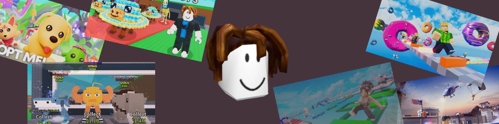

<div align="center">



<br />
<br />

<a href="https://baconhead-page.vercel.app/">
  
</a>
&nbsp;
<a href="https://discord.gg/AYyU5JZ4UK">
  
</a>

<br />
<br />

**roblox bot that watches you play, learns game states from your gameplay, and takes over when you go idle.**

uses vision model we trained to understand what's on screen and plan actions. trains a local ViT model (GameSense) to detect death screens, danger zones, and menus — no hardcoded game knowledge, works on any roblox game.

</div>

---

## demo


---

## how it works

1. you play roblox normally
2. after N seconds idle, the bot takes over
3. claude looks at your screen and decides what to do
4. GameSense (trained from your gameplay) detects deaths, danger, menus
5. you press any key and you're back in control

---

## setup

```bash
git clone https://github.com/your-username/baconhead.git
cd baconhead
python -m venv .venv && source .venv/bin/activate
pip install -r requirements.txt
cp .env.example .env
# add your ANTHROPIC_API_KEY to .env
```

macos only rn. needs accessibility permission for keyboard/mouse control:
**System Settings → Privacy & Security → Accessibility** → add your terminal app.

---

## train GameSense

collect data by playing roblox (auto-labels frames from your gameplay):

```bash
python -m vision.collect --seconds 120 --out game_data
```

train the model:

```bash
python -m vision.train --data game_data --out game_sense.pt --epochs 10
```

prints per-class precision/recall when done. more data = better model.

---

## run

```bash
# basic — takes over after 3s idle
python run_takeover.py

# custom idle time + trained model
python run_takeover.py --idle 10 --model game_sense.pt

# monitor decisions to a log file
python run_takeover.py --idle 7 --model game_sense.pt --monitor bot_log.tsv

# no claude (random actions, for testing)
python run_takeover.py --no-scout

# capture only (no bot, just screen grab)
python run_capture.py --report --seconds 30
```

For the obby-beating implementation, use the `ObbyBeater` branch:

```bash
git checkout ObbyBeater
```

---

## contribute

1. fork this repo
2. create a branch (`git checkout -b my-feature`)
3. make your changes
4. open a PR

---

## todo

- [ ] collect more training data across different roblox games
- [ ] self-improving loop (bot labels its own gameplay data while running)
- [ ] add temporal context to GameSense (sequence of frames, not just one)
- [ ] obstacle avoidance from learned danger predictions
- [ ] multi-platform support (windows, linux — currently macos only)
- [ ] web dashboard for monitoring bot decisions live
- [ ] support custom action spaces beyond WASD
- [ ] fine-tune claude prompts based on per-game performance metrics
- [ ] replay buffer for offline RL training
